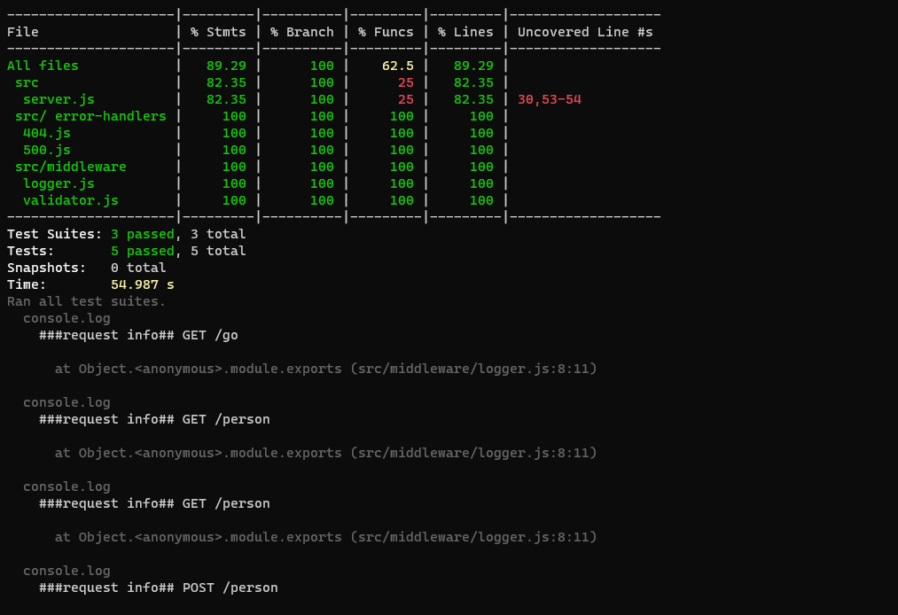
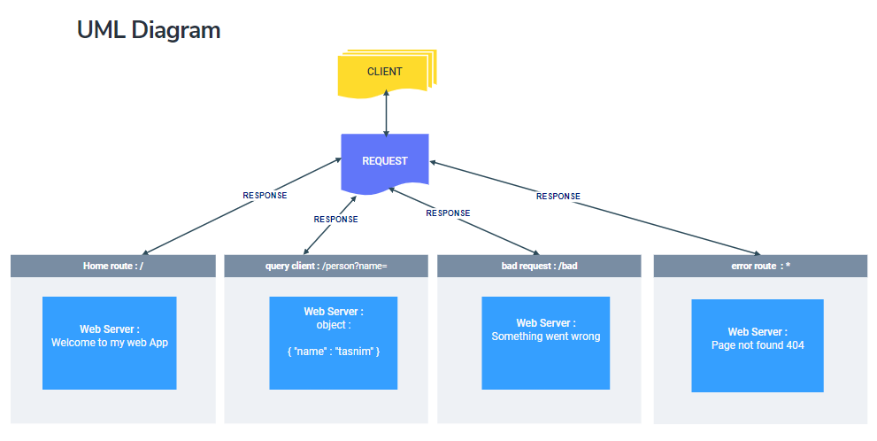

# -basic-express-server

## LAB - 02
## **Author: Tasnim Wheebi**

## **Deployment Test**

[PR LINK](https://github.com/Tasnimwheebi/basic-express-server/pull/2 )

[Heroku APP](https://tasnim-basic-express-server.herokuapp.com/ )

## **Setup**
* .env requirements
  * PORT - 3000

## **Running the app**
npm start

* Endpoint :

 <localhost:3000/person?name=>

    [{"name":"tasnim"}]

  * `/`
            
        Return Welcome to my web App

  * `/bad` 

          Something went wrong

  * `*`

        Page not found 404
## **Tests**
npm test 

* 404 on a bad route
* 404 on a bad method
* 500 if no name in the query string
* 200 if the name is in the query string
* given an name in the query string, the output object is correct

## **UML**

